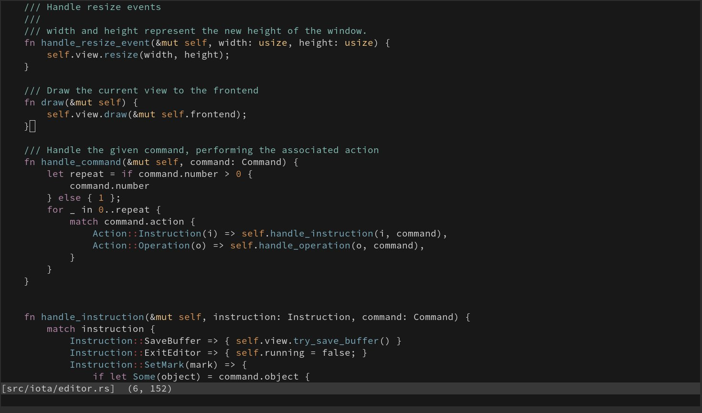

# Iota [](https://travis-ci.org/gchp/iota)

[](https://gitter.im/gchp/iota?utm_source=badge&utm_medium=badge&utm_campaign=pr-badge&utm_content=badge)

Iota is a terminal-based text-editor written in Rust.

Here's what it looks like right now, editing itself.



## Motivation

Iota was born out of my frustrations with existing text editors. Over the years I've tried
combinations of simple text editors, IDEs and everything in between. None of them felt right
to me, however. Some were too slow & bulky, others were too difficult to customise and still
others were platform specific and I couldn't use them on all my machines.

I started building Iota with the view of combining ideas and features from serveral different
editors while designing it to work on modern hardware.

Why Rust? Because its fun and why not!

## Goals

The goals for Iota are that it would be:

- 100% open source
- highly extensible/customisable/scriptable
- fast & efficient - designed with modern hardware in mind
- cross platform - it should work anywhere
- developer friendly - it should just "get out of the way"
- Rust tooling integration (see note below)

Iota is still in the very early stages, and is probably not ready for every day use.
Right now the focus is on implementing and polishing the basic editing functionality.

Windows support is coming, but it's somewhat slow right now. Help with this would
be greatly appreciated!

**Note on Rust integration:**
_The aim is to support code editing in all languages (and of course plain text),
with a lean towards Rust and integration with Rust tools. I don't intend it to
be a "Rust IDE" or "Rust only", however I think it would be cool to experiment with
integration with Rust tooling. This could also be applied to other languages too._

## Building

Clone the project and run `cargo build --release`.

**NOTE:** Iota needs to be built using the nightly toolchain for now, not stable.
[Rustup](https://github.com/rust-lang-nursery/rustup.rs) is very useful for managing
multiple rust versions.

Once you have the source, run:

## Usage

To start the editor run `./target/release/iota /path/to/file.txt`. Or
simply `./target/release/iota` to open an empty buffer.

You can also create buffers from `stdin`.

```bash
# open a buffer with the output of `ifconfig`
ifconfig | ./target/release/iota
```

You can move the cursor around with the arrow keys.

The following keyboard bindings are also available:

- `Ctrl-s` save
- `Ctrl-q` quit
- `Ctrl-z` undo
- `Ctrl-y` redo

Iota currently supports both Vi and Emacs style keybindings for simple movement.

You can enable Vi style keybindings by using the `--vi` flag when starting Iota.
The vi-style modes are in the early stages, and not all functionality is there
just yet. The following works:

- while in normal mode:
    - `k` move up
    - `j` move down
    - `l` move forwards
    - `h` move backwards
    - `w` move one word forward
    - `b` move one word backward
    - `0` move to start of line
    - `$` move to end of line
    - `d` delete
    - `u` undo
    - `r` redo
    - `i` insert mode
    - `:q` quit
    - `:w` save
- while in insert mode:
    - `ESC` normal mode

Alternatively, you can use the following emacs-style keys by using the `--emacs` flag:

- `Ctrl-p` move up
- `Ctrl-n` move down
- `Ctrl-b` move backwards
- `Ctrl-f` move forwards
- `Ctrl-a` move to start of line
- `Ctrl-e` move to end of line
- `Ctrl-d` delete forwards
- `Ctrl-h` delete backwards
- `Ctrl-x Ctrl-c` quit
- `Ctrl-x Ctrl-s` save
- `Ctrl-z` undo
- `Ctrl-y` redo
